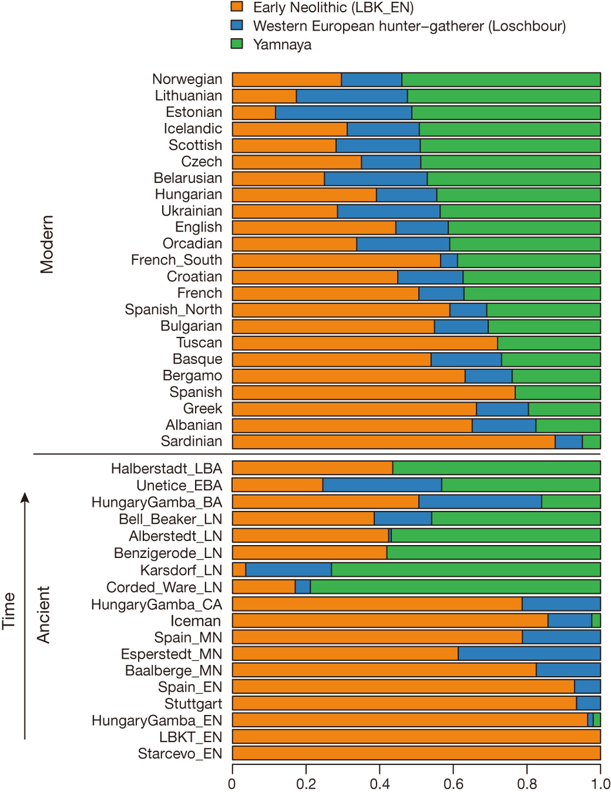

# Goals

We wanted to develop an analogous model to STRUCTURE for ancient DNA data that borrowed information from ancient DNA data to define the clusters in pooled modern + ancient SNP data. We first became interested in this from reading Haak et al 2015 in which they claimed that modern Europeans can be written as a mixture of 3 ancestral source populations and produced the following figure.

To estimate the admixture proportions ($\alpha_i$), Haak et al. used the "F4 statistics" concept (a statistic pioneered from their group) where,

$$f_4(Test; A; B, C) \approx \sum_{i=1}^N \alpha_i f_4(Ref_i; A; B,C)$$

with $\sum_{i=1}^N \alpha_i = 1$ and $\alpha_i \geq 0$ and $Test$ represent the allele frequency of the test population (which are modern day populations in this case) and $A$,$B$,$C$ are the allele frequencies of the "outgroups"" populations. $Ref_i$ is the allele frequency of the $ith$ ancient population.

The F4 statistic is defined as:
$$f_4(Test; A; B, C) = E[(Test-A)(B-C)]$$

There are $n{n-1 \choose 2}$ combinations of $A,B,C$ Thus, for one test population, they have $n{n-1 \choose 2}$ linear equations and solve for $\alpha_i$ by least squares. 

Why do we feel that there's room for an alternate analysis? Firstly, we wanted to apply a more standard approach that is easier to interpret. We know that the STRUCTURE model is one such approach and has been proved to be effective for population genetic data-sets. Secondly, we wanted to cluster the data using the genotype data so as to get a better feel of within group hetereogeneity (instead of the allele frequencies which they are using in their F4 approach). Thirdly, Haak et al fixed 3 source populations (Yamanya, LBK-EN, Loschbour) and expressed the modern day Europeans as a mixture of these 3 ancient source populations. From this analysis, Haak et al claim that Europeans therefore can be written as a mixture of just these 3 ancient populations. However, there might be a possibility that there are some unknown ancient populations which modern day populations derive significant ancestry from; which the authors did not investiage. Fourthly, there has been many other papers that apply ADMIXTURE to pooled ancient + modern day data that do not take account of the hierarchy of the pooled ancient + modern day data. 

