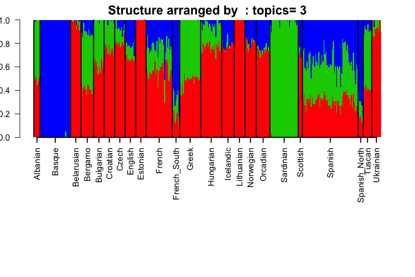
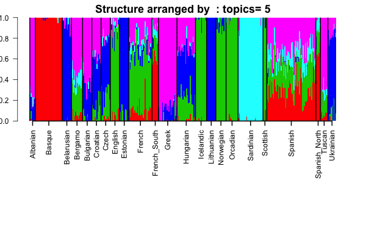
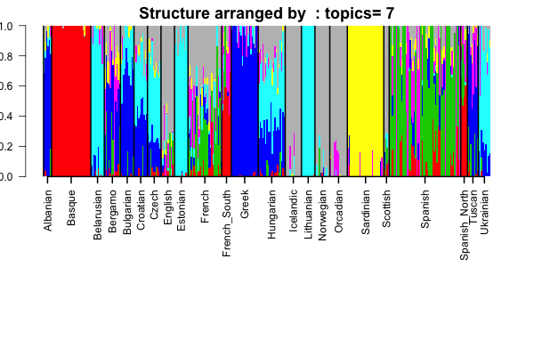
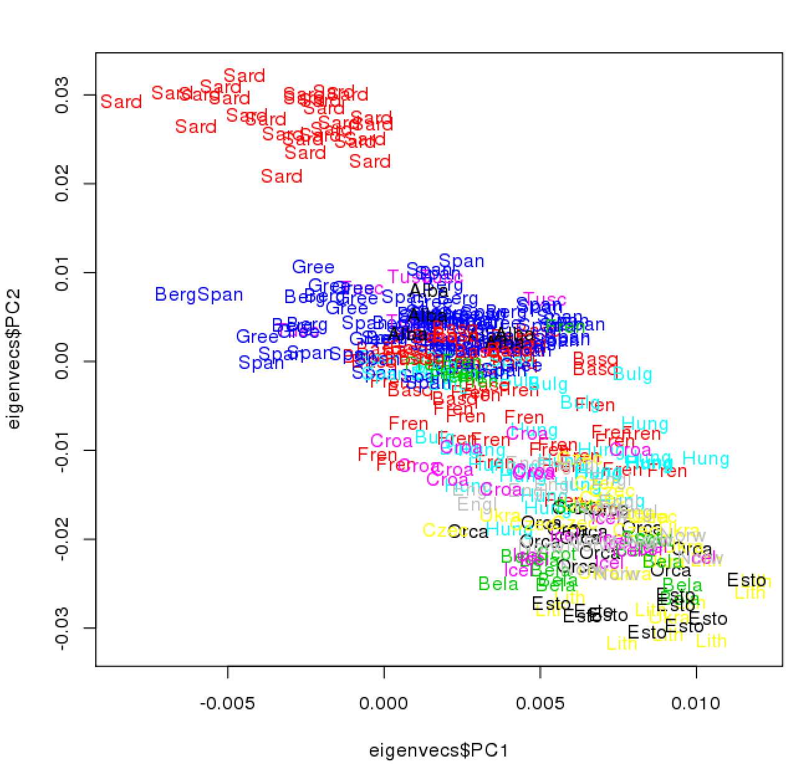
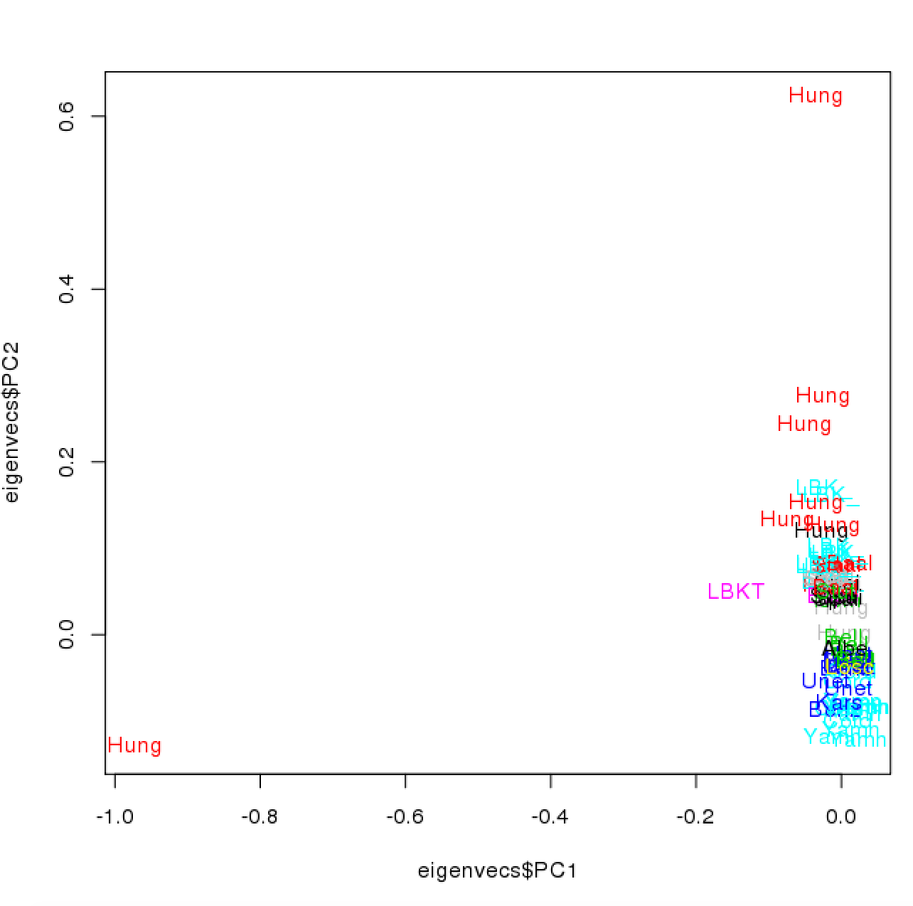
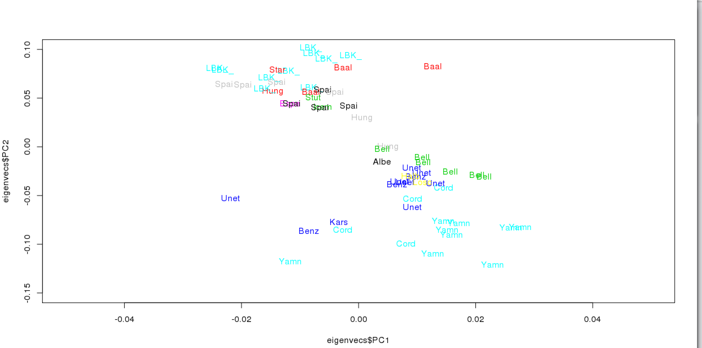
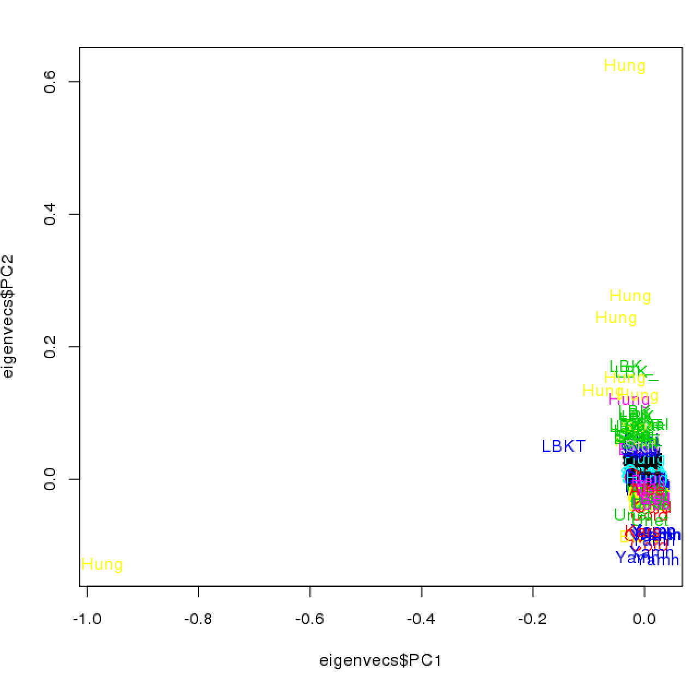
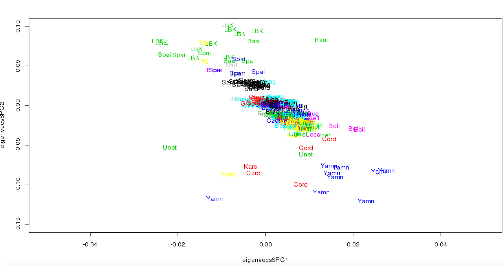
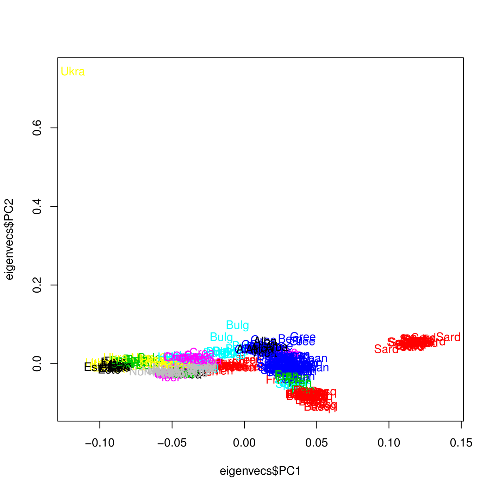

## Exploratory analysis of Haak Human Origins data 

From the Haak + Human Origins dataset, we extracted overall 403 samples (both modern and ancient)
 that were used in Figure 1 (Haak et al). There were in total 21 ancient populations with varying sample sizes and 23 modern populations from which the samples were considered. We fitted the admixture model due to David Alexander (UCLA) [software](https://www.genetics.ucla.edu/software/admixture/). We first show the admixture analysis for $K=3,5,7$. 
 
### admixture analysis  (Ancient + Modern)

```{r admix, echo=FALSE, eval=TRUE, results='hide', message=FALSE}
library(data.table)
library(CountClust)
data.clst <- read.csv('../external_data/data.clst', stringsAsFactors = FALSE, header=FALSE, sep = "\t");
data.fam <- read.table('../external_data/haak_fig3.LDprune.fam');

pop_ids <- data.clst[match(data.fam$V2, data.clst$V2),3]


plot_admixture <- function(K, pop_ids)
{
  P_data <- data.frame(fread(paste0('Admixture/haak_fig3.LDprune.',K,'.P')));
  Q_data <- data.frame(fread(paste0('Admixture/haak_fig3.LDprune.',K,'.Q')))
  
modern_Q <- Q_data[1:331,];
ancient_Q <- Q_data[-(1:331),];

pop_ids_modern <- as.matrix(pop_ids[1:331]);


if(!dir.exists('Admixture/modern')) dir.create('Admixture/modern')
StructureObj_omega(modern_Q, samp_metadata = pop_ids_modern,
                    partition = 'TRUE',batch_lab = NULL,
                    path_struct = 'Admixture/modern',
                    control = list(cex.axis=1))

if(!dir.exists('Admixture/ancient')) dir.create('Admixture/ancient')
pop_ids_ancient <- pop_ids[-(1:331)];
StructureObj_omega(ancient_Q, samp_metadata = pop_ids_ancient,
                    partition = 'TRUE',batch_lab = NULL,
                    path_struct = 'Admixture/ancient',
                    control = list(cex.axis=1))
  
  
#   Q_data_pop <- sapply(1:K, function(num) tapply(Q_data[,num], pop_ids,mean));
# 
#   ancient_pop <- unique(pop_ids)[24:44];
#   modern_pop <- unique(pop_ids)[1:23];
# 
#   Q_data_pop_ancient <- Q_data_pop[match(ancient_pop,rownames(Q_data_pop)),];
#   Q_data_pop_modern <-  Q_data_pop[-match(ancient_pop,rownames(Q_data_pop)),];
# 
#   barplot(t(Q_data_pop_ancient),col=2:(K+1),axisnames=F,space=0,border=NA,main=paste("Ancient data: No. of clusters=",K),las=1,ylim=c(0,1),cex.axis=0.5,cex.main=1.4);
#   abline(v=1:length(ancient_pop))
#   mid_point =seq(0.5,dim(Q_data_pop_ancient)[1]-0.5,length.out=dim(Q_data_pop_ancient)[1]);
#   axis(1,at=mid_point, ancient_pop,las=2,cex.axis=0.5);
# 
#   print("")
#   
#  barplot(t(Q_data_pop_modern),col=2:(K+1),axisnames=F,space=0,border=NA,main=paste("Modern data: No. of clusters=",K),las=1,ylim=c(0,1),cex.axis=0.5,cex.main=1.4);
#   abline(v=1:length(modern_pop))
#   mid_point =seq(0.5,dim(Q_data_pop_modern)[1]-0.5,length.out=dim(Q_data_pop_modern)[1]);
#   axis(1,at=mid_point, modern_pop,las=2,cex.axis=0.5);
}
```

### K=3 

```{r ancient_admixture_3, echo=FALSE, eval=TRUE, message=FALSE}
plot_admixture(3,pop_ids)
```


### K=5

```{r ancient_admixture_5, echo=FALSE, eval=TRUE, message=FALSE}
plot_admixture(5,pop_ids)
```


### K=7 

```{r ancient_admixture_7, echo=FALSE, eval=TRUE, message=FALSE}
plot_admixture(7,pop_ids)
```


### admixture analysis  (Modern)

```{r admix_modern, echo=FALSE, eval=TRUE, results='hide', message=FALSE}
library(data.table)
library(CountClust)
data.clst <- read.csv('../external_data/data.clst', stringsAsFactors = FALSE, header=FALSE, sep = "\t");
data.fam <- read.table('../external_data/haak_fig3.LDprune.fam');

pop_ids <- data.clst[match(data.fam$V2, data.clst$V2),3]

pop_ids_modern <- as.matrix(pop_ids[1:331]);


plot_admixture_modern <- function(K, pop_ids)
{
  P_data <- data.frame(fread(paste0('../bin/admixture_modern/haak_fig3.LDprune.moderns.',K,'.P')));
  Q_data <- data.frame(fread(paste0('../bin/admixture_modern/haak_fig3.LDprune.moderns.',K,'.Q')))
  
  modern_Q <- Q_data

if(!dir.exists('Admixture/modern_only')) dir.create('Admixture/modern_only')
StructureObj_omega(modern_Q, samp_metadata = pop_ids_modern,
                    partition = 'TRUE',batch_lab = NULL,
                    path_struct = 'Admixture/modern_only',
                    control = list(cex.axis=1))


  
#   Q_data_pop <- sapply(1:K, function(num) tapply(Q_data[,num], pop_ids,mean));
# 
#   ancient_pop <- unique(pop_ids)[24:44];
#   modern_pop <- unique(pop_ids)[1:23];
# 
#   Q_data_pop_ancient <- Q_data_pop[match(ancient_pop,rownames(Q_data_pop)),];
#   Q_data_pop_modern <-  Q_data_pop[-match(ancient_pop,rownames(Q_data_pop)),];
# 
#   barplot(t(Q_data_pop_ancient),col=2:(K+1),axisnames=F,space=0,border=NA,main=paste("Ancient data: No. of clusters=",K),las=1,ylim=c(0,1),cex.axis=0.5,cex.main=1.4);
#   abline(v=1:length(ancient_pop))
#   mid_point =seq(0.5,dim(Q_data_pop_ancient)[1]-0.5,length.out=dim(Q_data_pop_ancient)[1]);
#   axis(1,at=mid_point, ancient_pop,las=2,cex.axis=0.5);
# 
#   print("")
#   
#  barplot(t(Q_data_pop_modern),col=2:(K+1),axisnames=F,space=0,border=NA,main=paste("Modern data: No. of clusters=",K),las=1,ylim=c(0,1),cex.axis=0.5,cex.main=1.4);
#   abline(v=1:length(modern_pop))
#   mid_point =seq(0.5,dim(Q_data_pop_modern)[1]-0.5,length.out=dim(Q_data_pop_modern)[1]);
#   axis(1,at=mid_point, modern_pop,las=2,cex.axis=0.5);
}
```

### K=3 

```{r ancient_admixture_modern_3, echo=FALSE, eval=TRUE, message=FALSE}
plot_admixture_modern(3,pop_ids)
```




### K=5

```{r ancient_admixture_modern_5, echo=FALSE, eval=TRUE, message=FALSE}
plot_admixture_modern(5,pop_ids)
```



### K=7 

```{r ancient_admixture_modern_7, echo=FALSE, eval=TRUE, message=FALSE}
plot_admixture_modern(7,pop_ids)
```



Next we look at the top Principal components (PC1, PC2 and PC3) of the aggregated modern and ancient data.


### pca

We provide the PC1 vs PC2 comparison for the Haak Human origins data. We applied the PCA on the pooled modern and ancient sample. However, here we break down the graphs separately for the moderns, the ancients and also give the actual whole PCA plot for pooled modern and ancient data.

The modern data 



The ancient data





The ancient and modern pooled data 






Next we just focussed on the modern samples and did a PCA on the modern samples exclusively. Here we plot the PC1 versus PC2 plot for the modern samples only.




```{r}
sessionInfo()
```